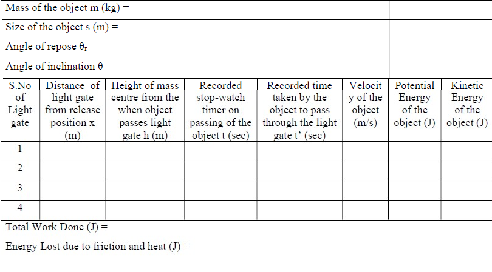

## Procedure
### In real Laboratory
1. Measure the mass and size of the box using a weighing machine and scale respectively.
2. Set the plane at zero inclination and place the box at one upper end of the plane
3. Increase the angle of inclination slowly until the block begins to slip down. Repeat this process to
yield an average value of angle of repose θr. This can be used to calculate the coefficient of static
friction.
4. Clamp the light gates at definite intervals along the length of the inclined plane. The light gates
should be properly aligned so that the object passes through the light gate on sliding.
5. Set the angle of inclination of the plane slightly lesser than the angle of repose and gently push the
object or tap the plane to see if it slides down the plane. Repeat the experiment to get the minimum
angle at which the block slides at constant velocity. This can be used to determine the coefficient of
kinetic friction.
6. Set the desired angle of inclination greater than angle of repose. Allow the object to slide down the
plane from rest.
7. Tabulate the values in the following table
 

  

8. Plot the velocity-time graph, potential energy-time graph and kinetic energy-time graph

### In the simulator
1. Enter the mass and size of the block
2. Use the sliders to control the experimental setup (coefficient of static friction μs, coefficient of
kinetic friction μk, angle of inclination θ)
3. Lock the experimental setup and click the Play button
4. The simulator works in 3 stages
a. Stage 1 – The angle of inclination is increased slowly increased till the object placed at the
top of the incline slides down thereby enabling the user to determine the coefficient of static
friction from angle of repose)
b. Stage 2 – The slide is set at an angle less than the angle of repose and the same object is
allowed to slide by tapping the slide. The
c. Stage 3 – The slide is set at an angle greater than the angle of repose and the object is
released from rest from the top of the slide
5. The velocity, kinetic energy and potential energy are calculated in real time by the computer system
along with the velocity-time and kinetic energy-time and potential energy-time plots
6. The tabulated results are available for reference once the experiment is completed.
