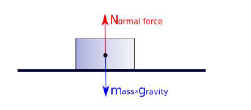
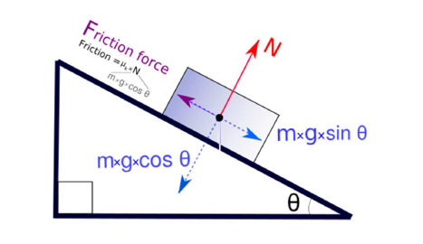
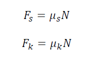
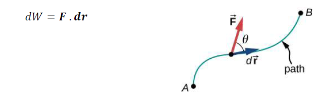
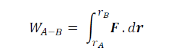
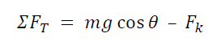
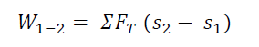
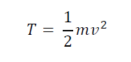
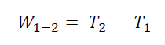
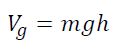

## THEORY

This experiment is an introduction to investigate the concepts of friction, work, kinetic and potential energy
conservative forces and the conservation of energy

### Frictional Force in Inclined Plane
When this object is resting on a level surface, its weight W of the object that acts through the centre of
gravity will be directed towards the centre of the Earth and perpendicularly to the surface. The surface will
exert an equal amount of force termed as the normal force perpendicular to the surface. The body is in
equilibrium since the normal force prevents the object from falling through the surface.
Now when

  

 

Now when the surface is inclined, the same weight W still acts on it, but the normal force will be a fraction
of the weight (as the weight can be resolved into individual components perpendicular to the plane and
parallel to the plane). This is illustrated in the figure below.

  

In addition to the above forces, an additional force comes into picture due to the relative contact between the
object surface and the plane. This force always acts tangent to the surface at the points of contact and tries to
oppose the motion between the surfaces. This force is called force of friction. If the body is idealised to be a
particle in particle dynamics, the frictional force can also be assumed to be acting along the centre of mass
Depending upon the numerical value of forces acting along the plane, the body may either be at rest or in
motion. The numerical value of friction during equilibrium is different than that during motion. However in
both cases, experiments have proved that F is directly proportional to the normal force N
The frictional force on an object when not in motion is termed as the static frictional force FS and that during
motion is called kinetic frictional force.

  

where the constant of proportionality μs and μk are called the coefficient of static friction and the coefficient
of dynamic friction respectively. The friction coefficients are functions of the contact materials. The force
necessary to induce motion (i.e. to overcome the static friction), is bigger than the one necessary to continue
the motion (i.e. to overcome kinetic friction). So the coefficient of kinetic friction (μk) is lower than the one
of static friction (μs).
In short, an object kept on a tilted surface may either be at rest or slide down the plane depending upon the
following factors
1. Weight of the Object
2. Angle of the inclined plane
3. Coefficient of friction between the surfaces in contact

### Work of Force
When a force is capable of producing a displacement on an object, it is said that work is done on the object.
In other words, work is the energy transferred to or from an object via the application of force along a
displacement.
Work is a scalar quantity and is given by the dot product of the force and displacement vectors for

  

where dr is the infinitesimal vector displacement of the point of application of F. The total work done as a
particle moves from point A to B is given as

  

The work done may be as a result of conservative or non-conservative forces. A conservative force is a force
that does zero work on a closed path. That is, the work done by conservative force in going from point A to
point B is independent of the path from A to B. Examples of conservative forces include gravity and the
spring force.
In case of free sliding motion, the resultant force in the direction of displacement is constant throughout the
motion. The magnitude of this tangential force ΣFT is given as

  

Therefore, the work done by sliding bodies can be given as

  

### Kinetic Energy
Kinetic energy T is the energy possessed by body by virtue of its motion. The energy of motion can be due to
translational and rotational motion of a body. In sliding bodies, the object is in translational motion and the
translational kinetic energy is given by the equation.

  

Where m is the mass of the object and v is its velocity
So the work done on an object to change its position from point 1 to 2 results in a change in the kinetic
energy of that object.

  

### Potential Energy

Work done on an object may be as a result of externally applied forces, gravity forces, spring forces,
electrostatic forces, etc. Work done by conservative forces such as gravity, elastic forces in spring and
electrostatic forces depends only on the initial and final positions of the object along the path. For
conservative forces, it is possible to specify a numerical value as a potential function of force depending
upon its position of object in space. This energy possessed by an object by virtue of this position is called
Potential Energy.
In this experiment of sliding bodies, we deal with gravitational forces and hence the potential due to gravity.
The gravitational potential energy Vg of the object is defined as the work done against the gravitational field
to elevate the object by a height with respect to an arbitrary datum (where Vg is taken as zero). So, if an
object is at a height y above the datum, the gravitational potential energy Vg can be given as

  

Please do keep in mind that the work done due to frictional forces is dependent upon the path (nonconservative
force) and hence cannot have a potential associated with them.
